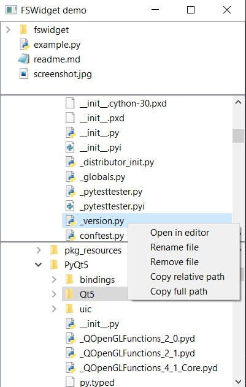

# About
### A Qt based file system viewer written in python using PyQt5
### No third party packages required except for PyQt5 required

---
# Features
- Display multiple views in single widget
- Set patterns to not show in view
- Create, rename, remove file or directory using a context menu
- Qt signals for information about creating/renaming/removing items
- Copy full or relative path of file or directory
- Set a custom icon provider

---
## Screenshot

---
## Qt Signals
- open_file_request: emitted when a file is double clicked
- new_file_created : emitted when new file is triggered using context menu
- new_dir_created  : emitted when new dir is triggered using context menu
- file_renamed     : emitted when rename file is triggered using context menu
- dir_renamed      : emitted when rename dir is triggered using context menu
- file_removed     : emitted when remove file is triggered using context menu
- dir_removed      : emitted when remove dir is triggered using context menu

---
## Confguration (It's name suggests it does!)
- can_create_file
- can_rename_file
- can_remove_file
- can_create_dir
- can_rename_dir
- can_remove_dir
### By default everything is true except for can_remove_dir due to a bug
### Removing a file or directory moves it to trash and does not permanately delete it

---
# Examples

### 1. Importing fswidget
```python
# Importing 'Config' is optional
from fswidget import FileSystemWidget, Config
```

### 2. Initializing the widget
```python
roots = ['path/to/dir/1', 'path/to/dir/2']
patterns = ['*.exe', '*.o', '*/env', '*/build']
config = Config(
    can_rename_file=False,
    can_rename_dir=False,
    can_remove_file=False,
    can_remove_dir=False,
) # you can only create

widget = FileSystemWidget(root, exclude_patterns=patterns, config=config)
```

### 3. Setting up signals
```python
widget.open_file_request.connect(lambda path: print(f"Opening {path}"))

widget.new_file_created.connect(lambda path: print(f"Created file: {path}"))
widget.file_renamed.connect(lambda old, new: print(f"Renamed file from {old} to {new}"))
widget.file_removed.connect(lambda path: print(f"Removed file: {path}"))

widget.new_dir_created.connect(lambda path: print(f"Created dir: {path}"))
widget.dir_renamed.connect(lambda old, new: print(f"Renamed dir from {old} to {new}"))
# Note: By default can_remove_dir is set to false
widget.dir_removed.connect(lambda path: print(f"Removed dir: {path}"))
```

### 4. Using a custom icons for files or directories
```python
class CustomIconProvider(QtWidgets.QFileIconProvider):
    def icon(self, info: QtCore.QFileInfo) -> QtGui.QIcon:
        # Example provider below. But your icon provider logic should be here
        if info.isFile():
            if info.fileName() == 'main.py':
                return QtGui.QIcon('path/to/icon')
        if info.isDir():
            if info.fileName() in ('env', 'environment'):
                return QtGui.QIcon('path/to/icon')

        return super().icon(info)

widget = FileSystemWidget(...)
widget.set_icon_provder(CustomIconProvider())
```

---
## How it works
- Widget contains a list of QTreeView displayed using QSplitter
- Each view displays a filtered QFileSystemModel
- Filtering is done using a subclass of QSortFilterProxyModel and fnmatch

---
### TODO (after initial commit)
- A workaround for removing a directory
- Implement drag and drop for moving items around
- Setting up user-defined conditions for creating/renaming/removing items

---
